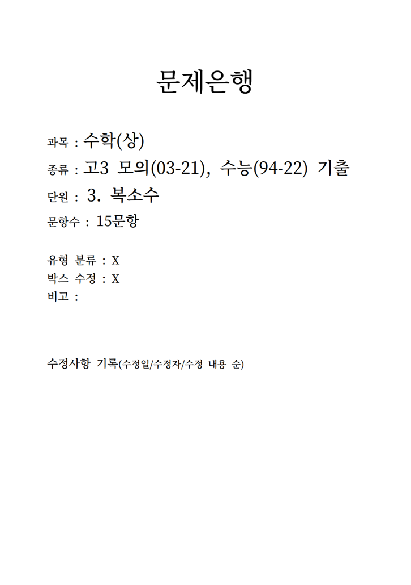
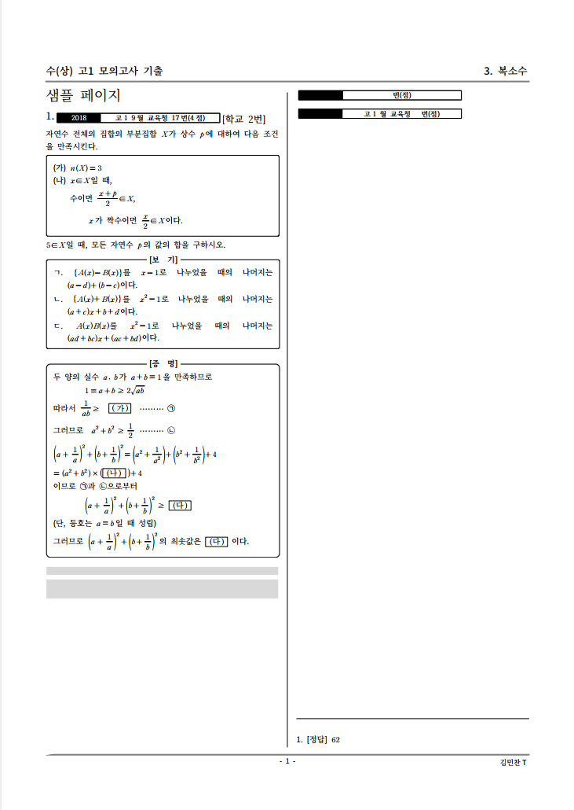
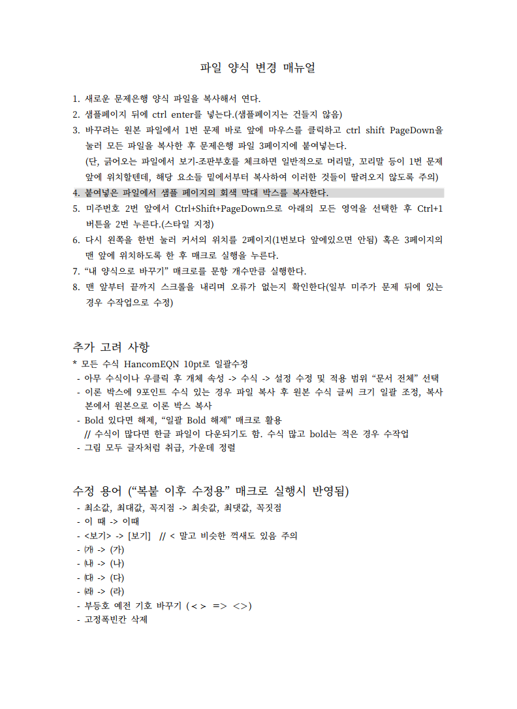
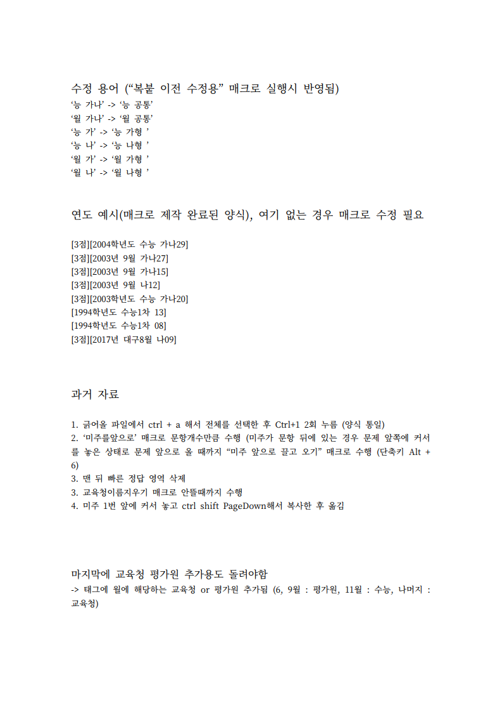
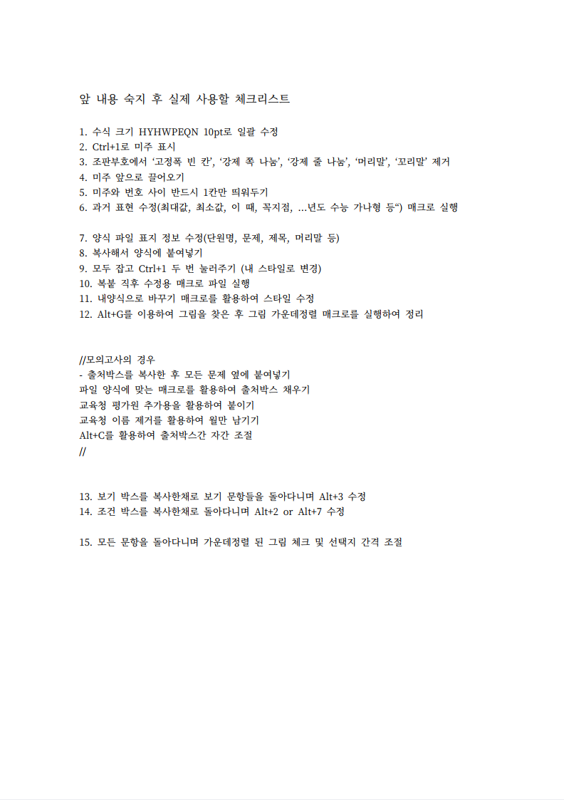
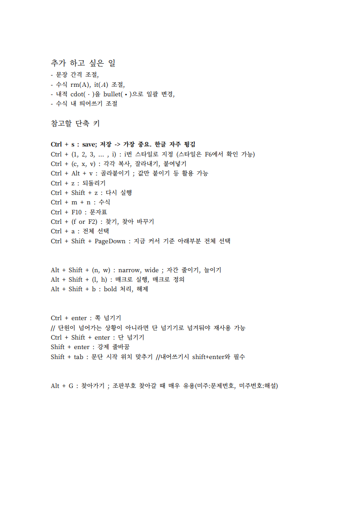

한글 문서 작업용 매크로
================

## About this

학원 강의 자료 제작을 목적으로 만들었던 한컴오피스 한글 키보드 녹화 방식 매크로 파일과 매뉴얼을 첨부합니다.

<br/>

## Environment

#### OS :  Windows 10

#### 한컴오피스 : 한컴오피스 2020 - 한글

<br/>


## Usage

1. 문제 뒤의 [4점][2018년 6월 나형 27] 과 같은 출처를 인식하여 태그를 입력하는 매크로를 실행한 화면입니다. 이전에 3번의 "미주 문제 앞으로"와 내 양식으로 수정(스타일 지정), 문제 번호 옆 동일한 박스를 붙이는 매크로를 진행한 상태에서 실행하면 됩니다.


<br/><br/>


2. 조건 박스와 보기 박스를 제 양식대로 수정하는 과정입니다. 보기 박스의 경우 어떤 양식에서는 표 형태로 구성되어 있는 등 다양한 양식이 있어 이를 고려한 매크로를 제작하였습니다.


<br/><br/>


3. 미주 번호를 문제 앞으로 이동시키기 위한 매크로를 사용중인 모습입니다. 대부분을 이동시켜야하는 경우에는 일괄적으로 횟수를 지정한 매크로를 실행하며, 일부만 옮기면 되는 경우 아래와 같은 작업을 수행합니다.


<br/><br/>


## Files

### 매크로 정리본(folder)

한글프로그램 실행 후 Alt+Shift+H(매크로 실행) 창에서 매크로 불러오기 아이콘을 선택하면 매크로 정리본의 개별 MSR 파일이나 꾸러미(HMI) 파일을 적용할 수 있습니다.

</br>

### 매크로 텍스트화(.txt)

각각의 매크로를 텍스트 파일로 남겨둔 것입니다.

</br>

### 매크로 정리 표(.txt)

단축키로 사용하기 편한 매크로를 우선적으로 배치하여 만들어둔 매크로 단축키 가이드라인입니다.

```
1. alt+1   원하는미주로이동
2. alt+2   조건박스수정용
3. alt+3   보기박스수정용
4. alt+4   짧은선지간격조정
5. alt+5   긴선지간격조정
6. alt+6   미주앞으로끌고오기
7. alt+7   조건박스수정용_표
8. alt+8   더긴선지간격조정
9. alt+9   
10. alt+0   
11. alt+-
12. alt+shift+1   실험용
13. alt+shift+2   복붙이전표현수정용
14. alt+shift+3   복붙직후표현수정용
15. alt+shift+4   내양식으로바꾸기
16. alt+shift+5   출처박스붙이기
17. alt+shift+6   그림_글자취급및가운데정렬
18. alt+shift+7   
19. alt+shift+8   학생용_정답만남기기
20. alt+shift+9   학생용_5개마다박스
21. alt+shift+0   교사용_답만
22. alt+shift+-   교사용_해설포함
23.    		
24.		교육청평가원붙이기		
25.		교육청이름제거
26.		출처박스자간조절
27.		
28.		단원별_고3_출처채우기
29.		단원별_고12_출처채우기
30. 	  사설포함_출처채우기
31.    	  예전부등식수정용
32.   	  bold 없애는 용도
33. 	  수식을텍스트로
34.		오답노트매크로
```

</br>

### 문제은행 양식(.pdf)

실제로 사용했던 문제은행 양식을 pdf로 변환한 것입니다.




</br>

### 파일 양식 변경 매뉴얼(.pdf)

실제로 사용했던 파일 양식 변경 매뉴얼을 pdf로 변환한 것입니다.






